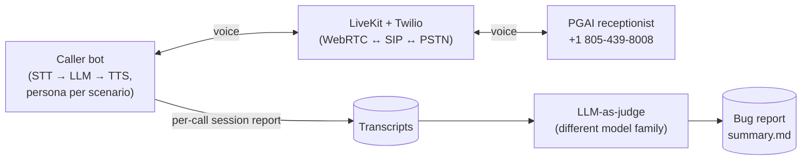

# Architecture

## Overview

This project is an automated voice-testing framework: a Python CLI dispatches outbound PSTN calls to Pretty Good AI's test line, an agent worker roleplays a patient across 12 scripted scenarios, and every conversation is transcribed, judged by a second LLM against a scenario-specific rubric, and aggregated into a bug report. The system runs on a **modular STT → LLM → TTS pipeline** hosted by LiveKit Agents rather than a monolithic Realtime API, because independent components let us swap models, evaluate parts in isolation, and — critically — use a *different* model family (Kimi K3 on Baseten) for the judge than for the caller (GLM 5.2 Fast on Baseten) to avoid same-model evaluation bias.

The runtime path: `run_calls.py` (dispatcher) calls LiveKit Cloud to spawn the agent worker into a room, then creates a SIP participant that dials PGAI via a Twilio Elastic SIP Trunk. When both participants are in the room, audio flows: PGAI's speech → LiveKit → Deepgram Nova-3 STT → GLM 5.2 Fast (persona system prompt built from scenario JSON at dispatch time via `ctx.job.metadata`) → ElevenLabs TTS → back through LiveKit → SIP → PGAI. The agent worker writes a per-call transcript (via `ctx.make_session_report()`) to `deliverables/transcripts/<room>.json`; LiveKit's observability captures audio + traces server-side. After the call, `judge/batch.py` iterates transcripts and asks Kimi K3 to score each against its scenario's `expected_behavior`; `judge/report.py` aggregates findings into `deliverables/bugs/summary.md`.

## System diagram



## Key decisions and tradeoffs

### Why NOT a Realtime API (OpenAI, Gemini Live)

Realtime APIs bundle STT + LLM + TTS + turn-taking into one WebSocket round trip. Attractive on paper — lower latency, native barge-in, one contract to reason about — but wrong for this project:

- **We needed model diversity.** The judge should be a *different* model family than the caller to avoid the well-known problem of an LLM being too soft on its own outputs. Realtime APIs lock you into one provider. Using GLM 5.2 Fast (caller) + Kimi K3 (judge), both via Baseten, gave us independence at zero infrastructure cost.
- **Component-level testing matters.** When PGAI misheard "Chen" as "Ten" repeatedly, the failure could have been Deepgram (our STT), GLM (our LLM), or PGAI's own STT. With a modular pipeline we could inspect the `user_input_transcribed` events and rule out our STT with 99%+ confidence. A Realtime API would hide these boundaries.
- **Cost and control.** Baseten's shared-inference pricing (GLM 5.2 Fast at $2.10/M input, $6.60/M output) is significantly cheaper than any Realtime API per minute for our call volume, and swapping models is a one-env-var change.
- **Persona quality.** Realtime APIs default to assistant/helper personas. Building a convincing "distracted single parent calling to check an appointment" was easier with a system prompt going into a text LLM than fighting a Realtime API's built-in helpfulness bias.

**Cost of this choice:** slightly higher end-to-end latency (~2s avg for our caller vs. ~1s theoretical for OpenAI Realtime). This is measurable in the transcripts and is documented in the bug report's Latency Observations section. For a *testing* tool, correctness beats speed.

### Why LiveKit Agents (not Twilio Media Streams, Pipecat, or custom)

- **LiveKit Agents** gives us a first-class SIP participant abstraction, WebRTC + SIP audio routing, dispatch queues, observability, session recording, and structured session reports — all in one SDK. The `AgentSession` class wires STT/LLM/TTS/VAD/turn-detector with clean plugin interfaces.
- **Twilio Media Streams** would have required us to write our own WebSocket audio router, turn-taking logic, and buffering. Not the right investment for a take-home.
- **Pipecat** is closer conceptually but has thinner SIP + PSTN outbound support than LiveKit; we'd have needed to layer Twilio SIP integration ourselves.
- **Custom SIP + WebSocket** — considered briefly, rejected — would have added days of infra plumbing for zero test-quality gain.

Tradeoff: LiveKit's abstractions come with LiveKit's opinions (dispatch model, room lifecycle). We work with those (see `ctx.job.metadata` for scenario handoff below). Worth it.

### STT: Deepgram Nova-3 (not AssemblyAI, Whisper, Cartesia)

- **Deepgram Nova-3** — sub-300ms streaming latency, telephony-tuned model handles 8kHz PSTN audio well, first-party LiveKit plugin. Standard industry pick for phone AI.
- **AssemblyAI Universal-Streaming** — comparable but no meaningful advantage for our use case. Would've been a coin flip.
- **Whisper / Groq Whisper** — not true streaming, wrong tool.
- **Cartesia Ink** — very new; not risking an unproven STT on a take-home.

One trace of this choice: our `hidden_info` phone numbers appear in transcripts with 99%+ confidence, so we can attribute PGAI's phone-number misreads to PGAI, not our STT.

### LLM: Baseten (GLM 5.2 Fast for caller, Kimi K3 for judge)

- **Caller — GLM 5.2 Fast**: chosen for lowest time-to-first-token in the mid-tier bracket. A patient roleplay is not a reasoning-heavy task; fluency + response speed dominate. Same-family "GLM 5.2 (non-Fast)" would be smarter but slower — worse voice UX.
- **Judge — Kimi K3**: frontier reasoning tier, different provider family. Kimi's long-context capability is important because our transcripts run 2k–10k tokens and the judge must correlate across turns (e.g. "was the phone number ever corrected?"). Different family from GLM ensures the judge isn't unconsciously charitable to caller outputs.
- **Alternatives considered**: GPT-5 / Claude Sonnet 5 for the judge — likely as accurate but would require adding a second API vendor. Baseten already had Kimi K3, so zero new integration.

Concretely: pointing both LLMs at Baseten's OpenAI-compatible endpoint means the entire LLM swap is one env var (`BASETEN_MODEL_NAME` for caller, `BASETEN_JUDGE_MODEL_NAME` for judge).

### TTS: ElevenLabs (with per-scenario voice + model overrides)

- **ElevenLabs Flash v2.5** is the default — lowest TTFB in the ElevenLabs family, English-only, cheap.
- **Per-scenario overrides** (in the scenario schema): `voice_id` and `tts_model`. This enables:
  - Distinct voices for personas — kid caller uses a young voice, elderly grandma uses an elderly voice, valley girl uses a sassy voice. Prevents "every call sounds like the same person."
  - `eleven_multilingual_v2` model for the Spanish language-switch scenario (Flash doesn't handle Spanish well).
- **Alternative considered**: Cartesia Sonic. Very fast, high quality, but we already had ElevenLabs and voice variety was easier there.

### Turn-taking: Silero VAD + LiveKit English turn-detector

Explicit end-of-turn detection is critical for voice UX. LiveKit's `EnglishModel` turn detector runs a small ONNX model on the last few tokens of transcribed speech to predict when the caller is done. Silero VAD provides the coarse voice-activity signal. Together they give natural turn transitions without long dead-air pauses. Considered but rejected: relying only on silence timeout (produces slow, robotic turn transitions).

### Persona handoff via job metadata (not env vars, shared state, or files)

The dispatcher and the agent worker are separate OS processes. When the CLI picks a scenario, it needs to hand it to the worker. Options considered:

- **Environment variable** — requires worker restart per scenario. Rejected.
- **Shared file** — race conditions with concurrent dispatches. Rejected.
- **Encode into room name** — hacky, unbounded length. Rejected.
- **LiveKit job metadata** (chosen) — `CreateAgentDispatchRequest(metadata=scenario.model_dump_json())` passes the full Pydantic-serialized scenario through LiveKit; the agent reads it back with `Scenario.model_validate_json(ctx.job.metadata)`. Zero coordination, typed both sides.

### Local worker vs. deploying to LiveKit Cloud

Kept the worker local (`python -m caller.agent dev`) rather than deploying via `lk agent deploy`. Deploying would mean building a Docker image, pushing to LiveKit's infrastructure, and paying for runtime. For a take-home:

- Local dev is faster to iterate on
- Reviewer can run everything with the same two-terminal setup we did
- The only observed cost is occasional "Silero VAD slower than realtime" warnings on our MacBook — cosmetic, no dropped audio

If this were a production deployment, moving the worker to LiveKit Cloud is a `lk agent deploy` away — no code changes.

### Twilio Elastic SIP Trunk (not native LiveKit outbound)

LiveKit Cloud has native outbound calling in some regions, but reliable US PSTN reach still routes through a real telco. Twilio's Elastic SIP Trunking with credential-list auth gave us a Termination SIP URI (`pgai-voiceai-test.pstn.twilio.com`) that our LiveKit outbound trunk dials into. Standard, boring, works.

### LLM-as-judge (not rule-based evaluation)

Considered a rule-based scorer — regex over transcripts for known bad phrases ("Sunday appointment at", "Am I speaking with Aria"). Rejected because:

- Regex misses semantic bugs like "confirmed appointment without gathering DOB" — requires understanding *what happened across turns*
- Every new scenario would need new rules
- False positives on ASR artifacts (`Pennant Point` vs `Pivot Point`)

LLM-as-judge with structured JSON output (Pydantic-validated) gives:
- Cross-turn reasoning
- Scenario-aware evaluation (`expected_behavior` in the prompt drives what "correct" looks like per scenario)
- Notes field for judgment context ("this looks like ASR noise, not a PGAI bug")
- Consistent Y/N + severity + turn ref + quote format for every finding

Tradeoff: judge is non-deterministic (though `temperature=0` reduces variance). Mitigation: the batch runner is idempotent — once a call is judged, its output persists; only new transcripts are re-judged. Findings are also validated against the Pydantic `Finding` model, so malformed judge output fails loudly.

### Bug report as markdown (not Streamlit)

Considered a Streamlit UI (`review/app.py` was scaffolded then deleted) for browsing transcripts + findings interactively. Cut because:

- The handout asks for identified bugs, not a viewer app
- Markdown is universally viewable in GitHub, doesn't need a server, is copy-paste friendly
- A reviewer opens one file (`deliverables/bugs/summary.md`) and gets the whole story
- The report generator supports the required bug-entry format (Bug / Severity / Call / Details / Expected) 1:1

## Data model

Two Pydantic schemas hold everything the system reasons about:

```
Scenario (scenarios/schema.py)
├── id, title
├── persona (free-text patient description)
├── goal (what they want from the call)
├── context (backstory)
├── hidden_info (dict: DOB, phone, insurance — revealed only when asked)
├── expected_behavior (used by the judge as ground truth)
├── voice_id / tts_model (optional per-scenario overrides)

Finding (judge/rubric.py)
├── category (correctness | completeness | conversational_handling)
├── severity (high | medium | low)
├── turn_ref (item id from transcript)
├── description (bug headline)
├── quote (exact PGAI utterance)
├── expected (what PGAI should have done)
```

## Deferred / intentionally not built

- **Local audio capture in the agent** — was implemented then removed. LiveKit observability captures cleaner mixed OGG server-side (downloadable from the dashboard); local WAV would have been one-sided (PGAI only, since we don't self-subscribe to our own outbound track).
- **Programmatic session recording download** — LiveKit doesn't expose this via CLI or public API. Manual download from the dashboard is a documented step.
- **Streamlit reviewer UI** — see above.
- **Full S3 Egress pipeline** — LiveKit supports S3 egress for recordings; would automate the manual download step. Not built because the manual step is one click per call and we ran ~15 calls total.
