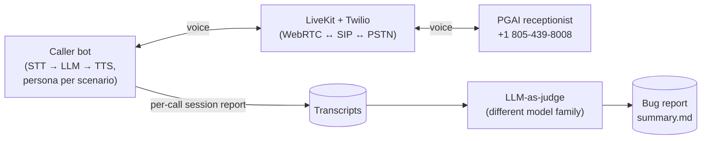

# Architecture

## Overview

This project is an automated voice-testing framework: a Python CLI dispatches outbound PSTN calls to Pretty Good AI's test line, an agent worker roleplays a patient across 12 scripted scenarios, and every conversation is transcribed, judged by a second LLM against a scenario-specific rubric, and aggregated into a bug report. The runtime path: `run_calls.py` asks LiveKit Cloud to spawn the agent worker into a room and creates a SIP participant that dials PGAI via a Twilio Elastic SIP Trunk. Once both participants are in the room, audio flows PGAI → Deepgram (STT) → GLM 5.2 Fast (LLM, with a persona prompt built from scenario JSON handed to the worker via LiveKit job metadata) → ElevenLabs (TTS) → PGAI. Each call's transcript is written to `deliverables/transcripts/`, then `judge/batch.py` sends every transcript to Kimi K3, a different model family from the caller, to score it against that scenario's `expected_behavior`, and `judge/report.py` aggregates the findings into `deliverables/bugs/summary.md`.

The system is built as a **cascaded pipeline** (separate STT/LLM/TTS components via LiveKit Agents) rather than a single Realtime API, and it evaluates results with a **cross-family LLM judge** rather than the caller model grading itself. Both choices trade a bit of latency and simplicity for something we cared about more: being able to point at any bug and say confidently whose fault it is.

## System diagram

## Key decisions

**Cascaded pipeline, not a Realtime API.** Realtime APIs (OpenAI, Gemini Live) bundle STT+LLM+TTS+turn-taking into one connection — lower latency, one vendor, less plumbing. We didn't use one for two reasons. First, component isolation matters for a *testing* tool: when PGAI misheard "Chen" as "Ten" repeatedly, we needed to rule our own STT in or out by reading Deepgram's transcribed output directly — a Realtime API would hide that boundary entirely. Second, we wanted the caller and the judge on different model families (below), which a bundled Realtime API doesn't allow. The cost is real: our own measured turn latency averaged ~2s end-to-end (see the bug report's Latency Observations), noticeably slower than a Realtime API's sub-second responses. For a correctness-focused tool we judged that acceptable.

**Cross-family LLM judge.** The caller runs on GLM 5.2 Fast (Baseten) — picked for low time-to-first-token, since a patient roleplay is fluency-bound, not reasoning-bound. The judge runs on Kimi K3, a different model family, also on Baseten. We wanted an independent evaluator rather than risk a same-family judge being systematically charitable to the caller's own conversational patterns; using a different lab's model for evaluation is a common mitigation for that risk. Kimi K3 also gave us a meaningfully deeper model for the reasoning the judge actually needs — correlating facts across a dozen turns (was a correction acknowledged three turns later? did the agent confirm a phone number it never asked for?) benefits from a stronger model than the fast, cheap one driving the caller.

**LiveKit Agents over Twilio Media Streams or Pipecat.** LiveKit gives us SIP participants, WebRTC/SIP audio routing, job dispatch, and session recording as one SDK, with an `AgentSession` that wires STT/LLM/TTS/VAD/turn-detection through clean plugin interfaces. Twilio Media Streams or a custom SIP/WebSocket bridge would have meant building that plumbing ourselves for no test-quality benefit.

**Persona handoff via LiveKit job metadata.** The dispatcher CLI and the agent worker are separate processes, so the chosen scenario has to cross a process boundary. We pass the full scenario as `CreateAgentDispatchRequest(metadata=scenario.model_dump_json())` and the worker reads it back with `Scenario.model_validate_json(ctx.job.metadata)` — no shared files, no env var restarts, typed on both ends.

**Everything else, briefly:** Deepgram Nova-3 for STT (telephony-tuned, streaming, standard for phone AI). ElevenLabs for TTS, with per-scenario voice/model overrides so the kid, the elderly caller, and the sassy caller don't all sound like the same person, and a multilingual model for the Spanish-switch scenario. Silero VAD + LiveKit's turn-detector for natural endpointing instead of a blunt silence timeout. Twilio Elastic SIP Trunk for PSTN reach. LLM-as-judge instead of a regex/rule scorer, because the bugs we cared about ("confirmed a booking without ever asking for DOB") are semantic and cross-turn, not pattern-matchable, and a rule catalog would need new entries for every new scenario.

## Scenario design philosophy

The 12 scenarios aren't a broad-coverage sweep of every possible clinic task — they're built around known failure modes of scheduling voice agents: constraint violations (Sunday booking), multi-intent utterances, identity/record ambiguity, out-of-scope requests, adversarial social engineering, language switching, and vulnerable-caller handling (a child, an elderly patient). This is closer to red-teaming than to QA checklist coverage. The judge's rubric mirrors the same three categories we designed scenarios around — correctness, completeness, conversational handling — so every finding traces back to a specific failure hypothesis we went in looking for, rather than an open-ended "did anything seem off" pass.
